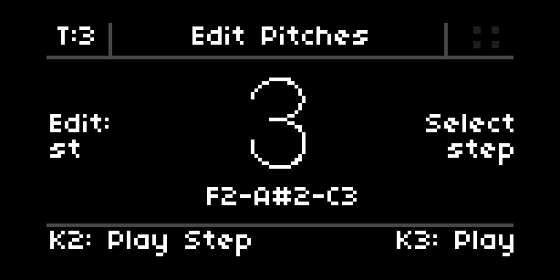
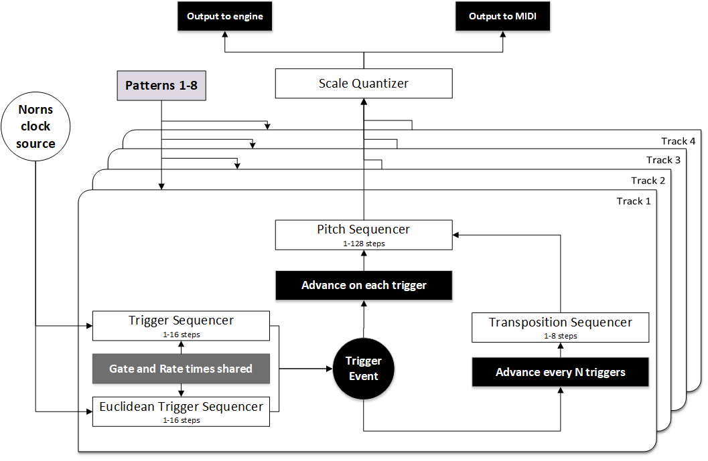

# Fourtunes
A 4-track polyphonic step sequencer for the Monome Norns.

Fourtunes is a 4-track polyphonic step sequencer, inspired by sequencers you’d find in instruments like the JX-3P and SH-101, and the unusual paths you find yourself wandering down when you trigger those sequencers with an external clock source (like a drum machine) that is decoupled from the programmed sequence of pitches.

Fourtunes currently requires MIDI input for programming pitches. Fourtunes can output MIDI on an independent channel for each track, and also integrates with the excellent Molly The Poly synth engine from @markeats. Each track output can be routed to MIDI, to the internal synth, or both.

Each of the four tracks contains the following:

A polyphonic pitch sequencer that is programmend in step time via MIDI
input.

A 16-step trigger sequencer that advances the pitch sequencer.

A 16-step euclidian rhythm based trigger sequencer that works in tandem with
the main trigger sequencer (or on its own if you leave the trigger sequencer empty) to advance the pitch sequencer.

An 8-step transposition sequencer that transposes the main pitch sequencer.

The length of each of the 4 sequences (pitch, trigger, euclidian trigger, transposition) can
be set independently while the sequencer is playing. The rate and gate times of the trigger and euclidian trigger sequencers are shared. The rate of the transposition sequencer can be set independently from the others.

There are 8 pattern slots available (a pattern being a collection of every sequencer from every track).

It all maps out like this:

### Controls:
Fourtunes features multiple pages/modes, but the controls all tend to follow the same pattern.

K1 - hold to shift
K2 and K3 - functions always displayed at the bottom of the selected page.

E1 - select current track
K1 + E1 - select current page/mode

E2 and E3 - change whichever parameter(s) are displayed on the left and right side of the main
viewport. If there are more than two parameters, K2 will select between the different parameter
pairs.

### Requirements:
MIDI input
